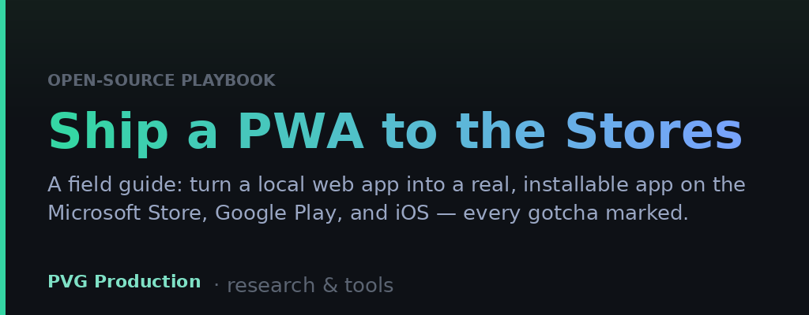

# Ship a Local Web App to the App Stores — a PWA → Microsoft Store / Google Play / iOS playbook

A field guide to turning a plain web app (even one that only runs on your own PC)
into a real, installable app on the **Microsoft Store**, **Google Play**, and the
**iOS App Store** — using a Progressive Web App (PWA), a free tunnel, and
[PWABuilder](https://www.pwabuilder.com/). No native rewrite, no cloud host
required.

I wrote this because I learned the whole thing from scattered blog posts, docs,
and forum answers, and hit a pile of small traps that cost hours each. This is the
guide I wish I'd had. Steal it, improve it, pass it on. 🙏

> **What this is not:** a way to sneak a low-effort web wrapper past Apple, or a
> substitute for reading each store's policies. It's the *mechanics* — the stuff
> that's annoying to piece together — with the pitfalls marked.

---

## What's in this kit (a follow-along, not just an essay)

```
├── README.md                       ← the guide (you're reading it)
├── CHECKLIST.md                    ← tick-through steps, fill in <PLACEHOLDERS>
├── LICENSE                         ← MIT
└── templates/
    ├── manifest.webmanifest        ← fill in your app name/colors/icons
    ├── sw.js                       ← service worker (edit CACHE + SHELL list)
    ├── pwa.js                      ← install prompt + SW register (drop-in)
    └── assetlinks.json             ← paste your package ID + Play SHA-256
```

**Start with [`CHECKLIST.md`](./CHECKLIST.md)** — it's the exact path, step by
step. Copy the `templates/` files into your app, replace every `<PLACEHOLDER>`
(your domain, your package ID, your signing fingerprint), and follow along. Come
back to this README whenever you want the *why* behind a step or hit a gotcha.

---

## The one big idea

Your web app + a **web manifest** + a **service worker** = a **PWA**. A PWA is
installable on every platform. PWABuilder then packages that same PWA into native
store bundles:

| Store | Bundle | Difficulty | Cost |
|---|---|---|---|
| **Microsoft Store** | MSIX | ⭐ easiest | **Free** dev account (individual fee waived) |
| **Google Play** | Android `.aab` (TWA) | ⭐⭐ | $25 one-time + hoops |
| **iOS App Store** | Xcode project | ⭐⭐⭐ hardest | $99/yr + **a Mac** + strict review |

And here's the part that surprised me most: **you don't need a web host.** A local
app running on your own machine can be given a stable public HTTPS address with a
**named Cloudflare Tunnel** (free). That URL is what PWABuilder and the stores
point at.

Recommended order: **PWA first → Microsoft Store → Google Play → iOS.** Ship the
easy, free one first for the morale win.

---

## Part 0 — Prerequisites

- A web app you can serve over HTTP locally (any stack; mine was a small Python
  server rendering an HTML dashboard).
- A domain (~$10/yr). Buying it at **Cloudflare Registrar** is convenient because
  the DNS is then already on Cloudflare for the tunnel.
- [PWABuilder](https://www.pwabuilder.com/) (web-based, free).
- Free accounts: Cloudflare, Microsoft Partner Center, Google Play Console.

---

## Part 1 — Make your web app a real PWA

Four pieces. Miss any and PWABuilder scores you poorly or the SW won't register.

### 1. A web manifest (`manifest.webmanifest`)
Link it in your `<head>`: `<link rel="manifest" href="/manifest.webmanifest">`.
Include, at minimum: `name`, `short_name`, `start_url`, `display: "standalone"`,
`theme_color`, `background_color`, `description`, and **icons at 192px and 512px
plus a 512px `"purpose": "maskable"`**. Adding `id`, `scope`, `orientation`, and
`categories` bumps your PWABuilder score.

### 2. A service worker (`sw.js`)
This is what makes it *installable*. It must be **served from your site root** so
its scope covers the app. A minimal one precaches the app shell for offline launch
and (optionally) handles push. Register it from the page.

> ⚠️ **Gotcha:** the service worker only registers over **HTTPS or `localhost`**.
> Testing over a plain `http://<LAN-IP>` address silently skips it and you'll
> think it's broken.

### 3. An install prompt / registration bootstrap (`pwa.js`)
A tiny standalone script (keep it *out* of your app bundle so you never rebuild to
tweak it): register the SW, capture `beforeinstallprompt` to show an "Install"
button on Android/desktop, and show an "Add to Home Screen" hint on iOS (iOS has
no install API).

### 4. Icons
Generate **192×192** and a **512×512 maskable** (logo inside the safe zone) in
addition to your 512 "any". Play and Lighthouse require them.

**Validate:** open `https://www.pwabuilder.com` and enter your URL. Fix reds
before packaging.

---

## Part 2 — Give a local app a stable public home (free)

If your app runs locally, expose it with a **named Cloudflare Tunnel** (not the
random `trycloudflare` quick tunnel — that URL rotates on every restart and a
store app is bound to one URL).

1. Cloudflare dashboard → **Zero Trust → Networks → Tunnels → Create tunnel →
   Cloudflared.**
2. Install the connector **as a service** (survives reboots) using the token it
   gives you: `cloudflared.exe service install <TOKEN>`.
3. Add a **public hostname**: `app.yourdomain.com → HTTP → localhost:<yourport>`.
   This auto-creates the DNS record.

Now `https://app.yourdomain.com` reaches your local app, permanently.

> ⚠️ **Serving gotcha (this one cost me the most):** whatever serves your files
> must actually return `sw.js`, `pwa.js`, your icons, `manifest.webmanifest`,
> **and later `/.well-known/assetlinks.json`** at those exact paths. If your
> server uses an allow-list, add every one of them. A 404 on `sw.js` makes
> PWABuilder report "no service worker" and blocks everything downstream — and
> the app still *looks* fine, so it's easy to miss.

> ⚠️ **Public access:** a store app opens for *strangers*, so the URL can't
> require a secret key/login to load. Serve a public (read-only) view by default;
> keep any private/owner view behind auth. And make `assetlinks.json` + your
> privacy page reachable **without** any key.

---

## Part 3 — Package and submit

### Microsoft Store (do this first — free & easy)
1. Create a **free individual** account at
   `developer.microsoft.com/microsoft-store/register` (the "Windows & Xbox"
   program — *not* the Cloud Partner Program).
2. **Apps and games → New product → MSIX or PWA app → reserve a name.**
3. Open the product → **Product management → Product Identity** and copy the three
   values: `Package/Identity/Name`, `Package/Identity/Publisher` (`CN=…`),
   `Package/Properties/PublisherDisplayName`.
4. PWABuilder → **Package For Stores → Windows** → paste those three → **Download**.
   No signing key to babysit — Microsoft signs via your store identity.
5. Partner Center → upload the **`.msixbundle`** (the store package, *not* the
   `.sideload.msix` — that one's only for testing on your own PC).
6. Fill Pricing (Free), Properties (category + privacy URL), Age ratings,
   Store listing (description + ≥1 screenshot), then Submit.

> ⚠️ **`runFullTrust` warning:** every PWABuilder MSIX declares this restricted
> capability and Partner Center asks you to justify it. It's normal — it's how the
> Hosted App Model runs your PWA as a Windows app. Explain that and submit; don't
> remove it.

> ✅ **No device verification, no tester requirement, no annual fee.** This is why
> it's the best first target. Certification is usually hours to ~3 days.

### Google Play (medium; a few hoops)
1. Play Console account: **$25 one-time**. Choose **"Yourself" (personal)** unless
   you have a registered business — "Organization" needs a D-U-N-S number.
2. PWABuilder → **Package For Stores → Android** → set your **Package ID**
   (⚠️ **permanent for the life of the app** — choose deliberately) → **create a
   new signing key**.
3. **BACK UP the signing keystore + both passwords** somewhere permanent. Lose
   them and you can never update the app — you'd have to publish a new listing.
4. Host the generated **`assetlinks.json`** at
   `https://app.yourdomain.com/.well-known/assetlinks.json`.
5. Upload the `.aab` to a **Closed testing** track.

> ⚠️ **Play App Signing fingerprint:** when you upload an `.aab`, Google re-signs
> it with *their* key. So the fingerprint that must be in `assetlinks.json` is
> Google's **App-signing key SHA-256** (Play Console → *App integrity → App
> signing*), **not** the upload key PWABuilder gave you. Add Google's after
> upload, or the installed app won't verify (URL bar stays).

> ⚠️ **Device + testing requirements:** new personal accounts must verify on a
> **physical Android 10+ phone** (emulators don't count — but it can be *anyone's*
> phone, once, in under a minute), and must run a **closed test with ~12–20
> testers for 14 days** before production. Recruit friends/followers — it doubles
> as early users.

### iOS App Store (hardest)
PWABuilder generates an **Xcode project**, but building/submitting requires a
**Mac** + Xcode, an **Apple Developer account ($99/yr)**, and Apple's strict
review (Guideline 4.2 "minimum functionality" for web wrappers — native push and
real app-like features help; and 5.x for regulated categories). No Mac = the real
blocker. Note that **iPhone users can already install your PWA today** via Safari →
Share → Add to Home Screen, so the App Store is the least urgent.

---

## Gotchas Hall of Fame (the real time-savers)

- **Service workers need HTTPS/localhost.** Plain-http LAN testing silently skips them.
- **404s on `sw.js` / icons / `assetlinks.json`** from an over-strict file server → PWABuilder reports missing SW / broken icons. Serve them at root, publicly.
- **The store app must load with no login** for the public view.
- **Package ID is permanent** on both stores — decide before your first upload.
- **Google re-signs your `.aab`** → put *Google's* app-signing SHA-256 in `assetlinks.json`, not the upload key's.
- **Back up your Android signing keystore + passwords.** Non-recoverable.
- **`runFullTrust`** on MSIX is normal for PWAs — justify, don't remove.
- **Rotating quick tunnels** are useless for store apps — use a *named* tunnel with a fixed domain.
- **Android device verification can be any borrowed phone, once.**
- **Each store's age-rating questionnaire differs** — answer honestly per store; the same app can land at different ratings.

---

## Compliance notes (if your app touches money/markets/anything regulated)

- Add a clear **"not financial advice"** (or equivalent) disclaimer, and a
  **privacy policy** hosted at a public URL (stores require the link to resolve).
- Keep the app **informational** — describe *state* ("underpriced," "at target"),
  not instructions ("buy now") — if you don't want to be treated as an
  advice/gambling app. Never let the app take payments or place real transactions
  if you want to stay out of the regulated-money bucket.
- Answer age-rating and data-safety forms **truthfully**. "No account, no
  analytics, no ads" is the cleanest possible data-safety story.

---

## Resources

- [PWABuilder](https://www.pwabuilder.com/) — the packager for all three stores
- [PWABuilder: publish to the Microsoft Store (free)](https://blog.pwabuilder.com/posts/publish-your-pwa-to-the-microsoft-store-on-windows-for-free/)
- [PWABuilder: publish to Google Play](https://blog.pwabuilder.com/posts/publish-your-pwa-to-the-google-play-store/)
- [PWABuilder: publish to the iOS App Store](https://blog.pwabuilder.com/posts/publish-your-pwa-to-the-ios-app-store/)
- [Cloudflare Tunnel (cloudflared)](https://developers.cloudflare.com/cloudflare-one/connections/connect-networks/)
- [web.dev — Progressive Web Apps](https://web.dev/explore/progressive-web-apps)
- [Digital Asset Links (Android verification)](https://developers.google.com/digital-asset-links/v1/getting-started)

---

## More from PVG Production

Three projects, one story — how a private research tool became a public app, and everything I learned shipping it:

- 📖 **[ship-pwa-to-stores](https://github.com/georgevillalobos/ship-pwa-to-stores)** — this guide *(you're here)*.
- 🎯 **[Prediction Command Center](https://github.com/georgevillalobos/prediction-command-center)** — the live research app this guide was written from · [live app](https://app.pvgproduction.com) · [Microsoft Store](https://apps.microsoft.com/detail/9NST6KJF5TGR)
- 🧩 **[prediction-agent-skeleton](https://github.com/georgevillalobos/prediction-agent-skeleton)** — a clean, runnable reference architecture for a self-grading research agent.

---

## License

Released under the **MIT License** — do anything you like, no attribution
required (though a link back is always appreciated). See `LICENSE`.

*If this saved you a few hours, pay it forward: open a PR with the next gotcha you
find.*
